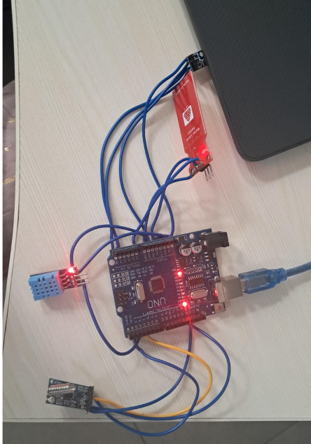
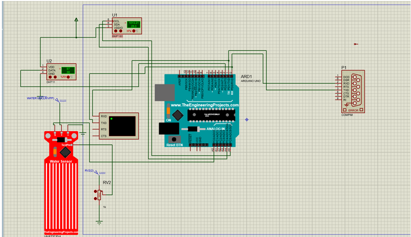

LoRa-Based Offline Weather Monitoring System
## Overview:
    Farming in hilly regions is challenging due to unpredictable weather, poor internet access, and difficulty in monitoring soil and climate conditions.
    Existing IoT solutions rely on the internet, making them unsuitable for such areas. 
## Objective:
    This project proposes an offline LoRa-based monitoring system to measure humidity, pressure, and soil moisture.
    Transmitting data over long distances without internet dependency, enabling farmers to make timely decisions and improve crop yield.
## Features: 
    Long-range communication using LoRa
    Works without internet
    Real-time temperature and humidity monitoring
    Low power consumption
    Suitable for remote locations
## Components Used:
    Arduino UNO 
    LoRa Module (SX1278)-Transmitter and Receiver
    DHT11 Sensor
    BMP280 Pressure Sensor
    Water Sensor
## Working:
    Sensors collect environmental data at the transmitter node, which is then sent through LoRa over distances ranging from 2 to 10 km depending on terrain and antenna quality. 
    The receiver processes and displays the real-time data for farmers to make informed decisions.
    
## Data Flow:
    Sensors → Arduino (Tx) → LoRa Transmitter → ~~~ Wireless Communication ~~~ → LoRa Receiver → Arduino (Rx) → Display
## Applications:
    Smart Agriculture: 
         Real-time monitoring of soil moisture, humidity, and pressure 
         Helps farmers optimize irrigation and crop management 
    Farming in Remote Areas: 
         Suitable for hilly and rural regions with no internet 
         Enables long-distance monitoring using LoRa
    Greenhouse Monitoring: 
         Maintains optimal temperature and humidity conditions 
         Improves plant growth and productivity 
    Precision Agriculture: 
         Data-driven decisions to increase crop yield 
         Reduces water and resource wastage
## Future Improvements:
     Integration with mobile app for easy monitoring 
     Addition of advanced sensors (temperature, rainfall, pH) 
     Implementation of automated irrigation system 
     Use of AI/ML for predictive farming 
     Solar-powered system for fully autonomous operation
## Output

 

    
    

    
    

